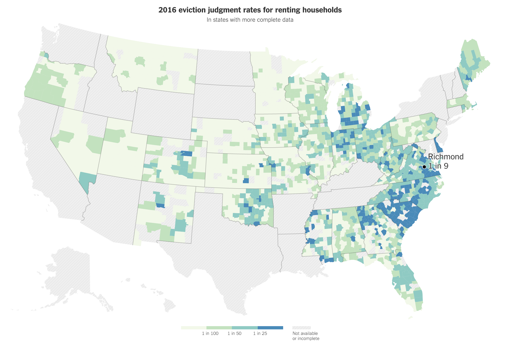

```{r setup, context = "setup", include=FALSE}
knitr::opts_chunk$set(echo = FALSE)
library(tidyverse)
library(evictionlab)
library(ggplot2)
library(tigris); library(sf)
library(DT); library(plotly)

options(tigris_class = "sf")

```

## Eviction Lab Methodology

```{marginfigure, echo = TRUE}



You can insert images into an R Markdown document that have been generated elsewhere. The map above is from a [New York Times article](https://www.nytimes.com/interactive/2018/04/07/upshot/millions-of-eviction-records-a-sweeping-new-look-at-housing-in-america.html) from earlier this year. The map illustrates which parts of the United States have fairly good coverage in the Eviction Lab data.

```

As the map on the right illustrates the Eviction Lab data are not yet comprehensive. The following code is used to restrict the data to only the states that are mostly complete. Code that is used to carry out an analysis can easily be included in the final output if desired. 

```{r states, contex = "data", cache = TRUE, echo = TRUE}
States <- tidycensus::fips_codes %>%
  filter(state_code <= 56) %>%
  select(state, state_code) %>%
  distinct() %>%
  filter(!state %in% c("AK", "AR", "ND", "SD", "AZ", "CA", "CT", "HI", "ID",
                      "KY", "LA", "MD", "NH", "NJ", "NY", "TN", "TX", "VT",
                      "WA", "WY"))
```

From the Eviction Lab website: 

>We have accumulated over 80 million records related to eviction. The Eviction Lab directly collected court records from 12 states. But many states either did not centralize their eviction data or were unwilling to release this information. Accordingly, the Eviction Lab then purchased more comprehensive datasets of public eviction records from two companies: LexisNexis Risk Solutions and American Information Research Services Inc.

>We also collected state reported, county-level statistics on landlord-tenant cases filed from 27 states, New York City, and the District of Columbia. This information was collected either from online reports or by contacting state judiciaries directly. 

See the [full methodology report](https://evictionlab.org/docs/Eviction%20Lab%20Methodology%20Report.pdf) for more detail.

```{r data, context = "data", cache = TRUE, include = FALSE}

Data <- lapply(States$state, function(state){
  get_evictions(state)
}) %>%
  bind_rows()

Places <- lapply(States$state_code, function(s){
  StateAbbr <- filter(States, state_code == s) %>%
    pull(state)
  
  places(s, cb = TRUE, year = 2016) %>%
    setNames(tolower(names(.))) %>%
    mutate(name = paste(name, StateAbbr, sep = ", "),
           geometry = st_transform(geometry, "+init=epsg:3857"))
})

Places <- do.call(rbind, Places)

BlockGroups <- lapply(States$state_code, function(state){
  block_groups(state, year = 2016) %>%
    setNames(tolower(names(.))) %>%
    mutate(geometry = st_transform(geometry, "+init=epsg:3857") %>%
             st_centroid())
})

BlockGroups <- do.call(rbind, BlockGroups)
```

## Eviction Trends

The data is not comprehensive. The unadjusted filing rate is shown in the chart below for all  data available.

```{r, fig.margin = TRUE}

Plot <- group_by(Data, year) %>%
  summarise(`eviction-filing rate` = sum(`eviction-filings`, na.rm = TRUE) / sum(`renter-occupied-households`, na.rm = TRUE))

P <- ggplot() +
  geom_line(aes(x = year, y = `eviction-filing rate`), data = Plot) +
  labs(title = "Eviction filing rate by year",
       caption = "Source: Eviction Lab")

P + 
  ggthemes::scale_color_fivethirtyeight() +
  ggthemes::theme_fivethirtyeight()
 
P + 
  ggthemes::scale_color_economist() +
  ggthemes::theme_economist()

```

```{marginfigure, echo = TRUE}
Same plot different themes.
```

```{r trend}
P
```

The chart above is generated using R's `ggplot2` library. It's very widely used for creating static graphics in R. See the [official website](https://ggplot2.tidyverse.org/reference/index.html) for a sense of what is possible using this system based on the Grammar of Graphics. [FiveThirtyEight](fivethirtyeight.com) typically uses ggplot and their own custom ggplot theme for static data visualization on their site.

```{r new, context = "data", cache=TRUE, warning=FALSE}

Population <- censusapi::getCensus("acs/acs5", vintage = 2016, vars = c("B01001_001E"),
                     region = "place:*") %>%
  mutate(placefp = paste0(state, place)) %>%
  filter(B01001_001E > 100000)

New <- mutate(BlockGroups, geometry = st_centroid(geometry)) %>%
  st_intersection(select(Places, placefp = geoid, place = name, geometry)) %>%
  semi_join(Population, by = "placefp")

```

## Eviction rate by place - 2016

2016 is the most recent year available from the Eviction Lab data.

Interactive tables are not strictly a data visualization but they can be utilized to allow readers to dig a bit deeper than a static (while still highlighting observations of interest). The [R package DT](https://rstudio.github.io/DT/) provides an R interface to the JavaScript library [DataTables](https://datatables.net/).

```{r table}
Plot <- left_join(Data, 
          select(New, geoid, placefp, place), by = "geoid") %>%
  filter(year == 2016 & !is.na(placefp)) %>%
  group_by(year, placefp, place) %>%
  summarise_at(.vars = c("evictions", "eviction-filings", "renter-occupied-households"), .funs = sum, na.rm = TRUE) %>%
  filter(evictions >= 100) %>%
  mutate(`eviction-filing rate` = `eviction-filings` / `renter-occupied-households`,
         `eviction rate` = evictions / `renter-occupied-households`) %>%
  arrange(desc(`eviction rate`))

ungroup(Plot) %>%
  select(place, `eviction-filing rate`, `eviction-filings`, `eviction rate`, evictions) %>%
  datatable(width = 400) %>%
  formatPercentage(c("eviction-filing rate", "eviction rate"), digits = 1)
```

## Eviction Filing and Judgment Rates using Plotly

```{marginfigure, echo = TRUE}

$\sqrt{-1}$ $2^{3}$ $\sum\pi$ and it was delicious. LaTeX math is supported.

```

This is a scatter plot of the `r nrow(Plot)` cities in the Eviction Lab data using [Plotly](https://plot.ly/). The eviction filing rate is $\frac{ \text{eviction filings} }{ \text{renter occupied households}}$ while the eviction rate is $\frac{ \text{eviction judgments} }{ \text{renter occupied households}}$.

```{r plotly}

plot_ly(Plot, y = ~`eviction rate`, x = ~`eviction-filing rate`, type = "scatter", mode = "markers",
        text = ~paste("Place: ", place))

```

This is a [prerendered shiny document](https://rmarkdown.rstudio.com/authoring_shiny_prerendered.html).
